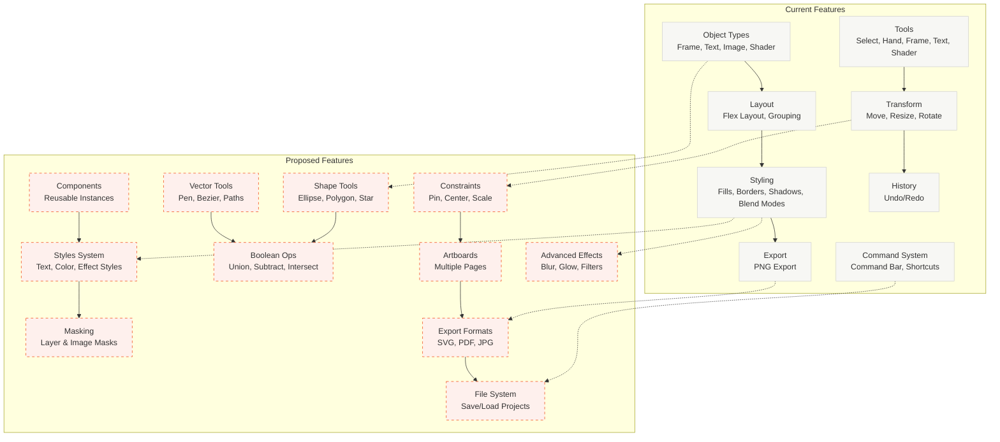
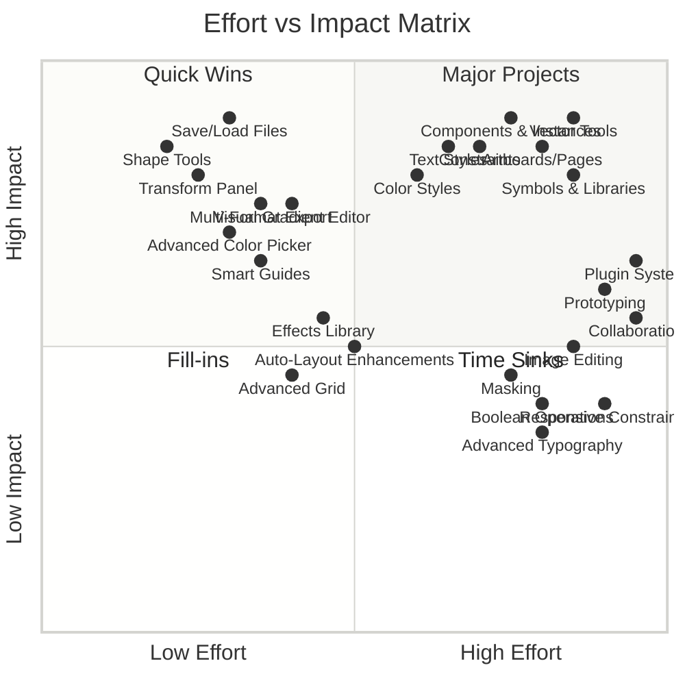

# Design Tool Feature Roadmap

A comprehensive roadmap of design tool features organized by effort level and strategic value.

**Prioritization Method**: Features are organized using an **Effort/Impact Matrix** (see below). This matrix helps identify:

- **Quick Wins**: Low effort, high impact (do first)
- **Major Projects**: High effort, high impact (strategic investments)
- **Fill-ins**: Low effort, low impact (nice to have)
- **Time Sinks**: High effort, low impact (evaluate carefully)

## Timeline Overview

```mermaid
%%{init: {'theme': 'base', 'themeVariables': {
  'primaryColor': '#F7F7F4',
  'primaryBorderColor': '#D4D4D0',
  'primaryTextColor': '#333',
  'secondaryColor': '#EAEBE7',
  'tertiaryColor': '#FEF0ED'
}}}%%
timeline
    title Design Tool Feature Roadmap
    section Quick Wins
        Shape Tools : Ellipse, Polygon, Star, Line
        Transform Panel : Numeric input for precise transforms
        Multi-Format Export : SVG, PDF, JPG export
        Save/Load Files : JSON project file format
        Advanced Color Picker : HSB, LAB, OKLCH support
        Visual Gradient Editor : Interactive gradient editing
        Smart Guides : Distance guides, alignment hints
    section Medium Effort
        Vector Tools : Pen tool, Bezier curves, paths
        Components & Instances : Reusable components with variants
        Text Styles : Character and paragraph styles
        Color Styles : Shared color palette system
        Boolean Operations : Union, subtract, intersect, exclude
        Masking : Layer masks, image masks
        Constraints : Pin to edges, center, scale
        Auto-Layout Enhancements : Grow/shrink, basis, gap controls
        Image Editing : Crop, filters, adjustments
        Effects Library : Blur, glow, backdrop filters
    section Strategic
        Artboards/Pages : Multiple canvas pages
        Symbols & Libraries : Shared component libraries
        Prototyping : Interactive prototypes, flows
        Collaboration : Comments, version history
        Plugin System : Extensible plugin architecture
        Advanced Typography : OpenType features, variable fonts
        Responsive Constraints : Breakpoint-based layouts
        Advanced Grid : Custom grid systems, guides
```

## Current vs Proposed Architecture

## Feature Details

### Quick Wins (Low Effort, High Impact)

#### Shape Tools

- **Ellipse Tool**: Create circles and ellipses
- **Polygon Tool**: Create polygons with configurable sides
- **Star Tool**: Create stars with configurable points
- **Line Tool**: Create straight lines and arrows
- **Impact**: Expands creative possibilities without complex vector math

#### Transform Panel

- **Numeric Inputs**: Precise X, Y, W, H, Rotation
- **Transform Origin**: Control rotation/scale origin
- **Impact**: Professional precision editing

#### Multi-Format Export

- **SVG Export**: Vector format for scalable graphics
- **PDF Export**: Document format for print
- **JPG Export**: Compressed raster format
- **Impact**: Broader compatibility and use cases

#### Save/Load Files

- **JSON Format**: Human-readable project files
- **File Operations**: Save, open, new project
- **Impact**: Essential workflow feature

#### Advanced Color Picker

- **Color Spaces**: HSB, LAB, OKLCH support
- **Color History**: Recently used colors
- **Impact**: Professional color workflow

#### Visual Gradient Editor

- **Interactive Editor**: Drag stops, adjust positions
- **Gradient Types**: Linear, radial, conic
- **Impact**: Better UX for gradient creation

#### Smart Guides

- **Distance Guides**: Show distances between objects
- **Alignment Hints**: Visual alignment indicators
- **Impact**: Faster, more precise alignment

### Medium Effort (Moderate Complexity)

#### Vector Tools

- **Pen Tool**: Create bezier paths
- **Path Editing**: Add/remove anchors, adjust handles
- **Path Operations**: Combine, simplify paths
- **Impact**: Professional vector editing capability

#### Components & Instances

- **Component Definition**: Create reusable components
- **Instances**: Linked copies that update together
- **Variants**: Component variants (states, sizes)
- **Impact**: Design system workflow, consistency

#### Text Styles

- **Character Styles**: Reusable text formatting
- **Paragraph Styles**: Reusable paragraph formatting
- **Style Updates**: Update all instances
- **Impact**: Typography consistency, efficiency

#### Color Styles

- **Color Tokens**: Shared color palette
- **Semantic Colors**: Primary, secondary, etc.
- **Style Updates**: Update all usages
- **Impact**: Design system consistency

#### Boolean Operations

- **Union**: Combine shapes
- **Subtract**: Remove one shape from another
- **Intersect**: Keep overlapping area
- **Exclude**: Remove overlapping area
- **Impact**: Complex shape creation

#### Masking

- **Layer Masks**: Mask objects with other objects
- **Image Masks**: Use images as masks
- **Mask Editing**: Adjust mask properties
- **Impact**: Advanced compositing

#### Constraints

- **Pin to Edges**: Left, right, top, bottom
- **Center**: Horizontal/vertical center
- **Scale**: Proportional scaling
- **Impact**: Responsive design workflow

#### Auto-Layout Enhancements

- **Flex Grow/Shrink**: Control flex behavior
- **Flex Basis**: Initial size before flex
- **Gap Controls**: Row/column gaps
- **Impact**: More flexible layouts

#### Image Editing

- **Crop Tool**: Interactive cropping
- **Filters**: Blur, brightness, contrast
- **Adjustments**: Levels, curves, saturation
- **Impact**: Image manipulation workflow

#### Effects Library

- **Blur Effects**: Gaussian, motion blur
- **Glow Effects**: Inner/outer glow
- **Backdrop Filters**: Background blur
- **Impact**: Visual effects library

### Strategic (High Complexity, Architectural)

#### Artboards/Pages

- **Multiple Artboards**: Separate design canvases
- **Artboard Management**: Create, delete, organize
- **Export Settings**: Per-artboard export
- **Impact**: Multi-page design workflow

#### Symbols & Libraries

- **Symbol Libraries**: Shared component libraries
- **Library Management**: Import/export libraries
- **Library Sync**: Update across projects
- **Impact**: Team collaboration, design systems

#### Prototyping

- **Interactive Prototypes**: Clickable prototypes
- **Flow Connections**: Link artboards
- **Transitions**: Animate between states
- **Impact**: Design-to-development workflow

#### Collaboration

- **Comments**: Add comments to objects
- **Version History**: Track changes over time
- **Multi-user**: Real-time collaboration
- **Impact**: Team workflow

#### Plugin System

- **Plugin API**: Extensible architecture
- **Plugin Marketplace**: Share plugins
- **Custom Tools**: User-defined tools
- **Impact**: Ecosystem growth

#### Advanced Typography

- **OpenType Features**: Ligatures, alternates
- **Variable Fonts**: Dynamic font variations
- **Text on Path**: Follow curves
- **Impact**: Professional typography

#### Responsive Constraints

- **Breakpoints**: Define responsive breakpoints
- **Constraint Rules**: Different constraints per breakpoint
- **Preview Mode**: Test at different sizes
- **Impact**: Responsive design workflow

#### Advanced Grid

- **Custom Grids**: User-defined grid systems
- **Guides**: Manual guides, smart guides
- **Grid Snapping**: Snap to custom grids
- **Impact**: Precision layout design

## Effort/Impact Matrix

### Quadrant Breakdown

#### 🎯 Quick Wins (Low Effort, High Impact)

**Priority: Do First**

These features provide maximum value with minimal development effort.

- **Shape Tools** - Ellipse, Polygon, Star, Line
- **Transform Panel** - Numeric inputs for precise transforms
- **Save/Load Files** - JSON project file format
- **Multi-Format Export** - SVG, PDF, JPG export
- **Advanced Color Picker** - HSB, LAB, OKLCH support
- **Visual Gradient Editor** - Interactive gradient editing
- **Smart Guides** - Distance guides, alignment hints

**Rationale**: These are mostly UI enhancements or straightforward extensions of existing systems. They significantly improve workflow without requiring architectural changes.

#### 🚀 Major Projects (High Effort, High Impact)

**Priority: Strategic Investments**

High-value features that require significant development but deliver transformative capabilities.

- **Components & Instances** - Reusable components with variants
- **Text Styles** - Character and paragraph styles
- **Color Styles** - Shared color palette system
- **Constraints** - Pin to edges, center, scale
- **Vector Tools** - Pen tool, Bezier curves, paths
- **Artboards/Pages** - Multiple canvas pages
- **Symbols & Libraries** - Shared component libraries

**Rationale**: These features enable design system workflows, professional vector editing, and multi-page design. They require architectural changes but unlock major capabilities.

#### 🔧 Fill-ins (Low Effort, Low Impact)

**Priority: Nice to Have**

Small improvements that are easy to implement but provide incremental value.

- **Auto-Layout Enhancements** - Grow/shrink, basis, gap controls
- **Effects Library** - Blur, glow, backdrop filters
- **Advanced Grid** - Custom grid systems, guides

**Rationale**: These extend existing features with additional options. Worth doing when there's spare capacity.

#### ⚠️ Time Sinks (High Effort, Low Impact)

**Priority: Consider Carefully**

Complex features that may not justify their development cost for most users.

- **Boolean Operations** - Union, subtract, intersect, exclude
- **Masking** - Layer masks, image masks
- **Image Editing** - Crop, filters, adjustments
- **Advanced Typography** - OpenType features, variable fonts
- **Responsive Constraints** - Breakpoint-based layouts
- **Prototyping** - Interactive prototypes, flows
- **Collaboration** - Comments, version history
- **Plugin System** - Extensible plugin architecture

**Rationale**: These require complex algorithms or infrastructure. Consider only if they align with specific user needs or strategic goals. Some (like Plugin System) might be worth it for ecosystem growth.

## Implementation Priority

### Phase 1: Quick Wins (Low Effort, High Impact)

**Focus: Maximum value with minimal effort**

1. **Save/Load Files** - Essential workflow foundation
2. **Shape Tools** - Ellipse, Polygon, Star, Line
3. **Transform Panel** - Numeric inputs for precision
4. **Multi-Format Export** - SVG, PDF, JPG
5. **Advanced Color Picker** - HSB, LAB, OKLCH
6. **Visual Gradient Editor** - Interactive editing
7. **Smart Guides** - Distance and alignment hints

### Phase 2: Major Projects (High Effort, High Impact)

**Focus: Strategic capabilities that transform the tool**

1. **Components & Instances** - Design system foundation
2. **Text Styles** - Typography consistency
3. **Color Styles** - Design token system
4. **Constraints** - Responsive design workflow
5. **Vector Tools** - Professional vector editing
6. **Artboards/Pages** - Multi-page workflow
7. **Symbols & Libraries** - Team collaboration

### Phase 3: Fill-ins (Low Effort, Low Impact)

**Focus: Incremental improvements when capacity allows**

1. **Auto-Layout Enhancements** - Flex improvements
2. **Effects Library** - Additional visual effects
3. **Advanced Grid** - Custom grid systems

### Phase 4: Time Sinks (High Effort, Low Impact)

**Focus: Evaluate based on specific needs**

Consider these only if they align with strategic goals:

- **Plugin System** - Ecosystem growth (may be worth it)
- **Prototyping** - Design-to-dev workflow (evaluate demand)
- **Boolean Operations** - Complex shape creation (niche)
- **Masking** - Advanced compositing (niche)
- **Image Editing** - Image manipulation (consider alternatives)
- **Advanced Typography** - OpenType features (niche)
- **Responsive Constraints** - Breakpoint system (complex)
- **Collaboration** - Real-time collaboration (infrastructure)

## Integration Points

### With Existing Systems

**Command System**: All new features should integrate with the command bar

- Shape tools: `ellipse`, `polygon`, `star`, `line` commands
- Components: `createComponent`, `detachInstance` commands
- Styles: `createTextStyle`, `applyStyle` commands

**Property Panel**: Extend property panel for new features

- Vector paths: Path editor component
- Components: Variant selector
- Styles: Style picker dropdown

**Export System**: Extend export for new formats

- SVG: Convert objects to SVG paths
- PDF: Use existing canvas rendering
- JPG: Add compression options

**Object System**: Extend type system

- New object types: `ellipse`, `polygon`, `path`, `component`
- New properties: `constraints`, `maskId`, `componentId`

## Notes

- **Backward Compatibility**: New features should not break existing projects
- **Performance**: Vector tools and complex operations need optimization
- **UX Consistency**: New features should match existing interaction patterns
- **Documentation**: Each feature needs command documentation and tooltips
